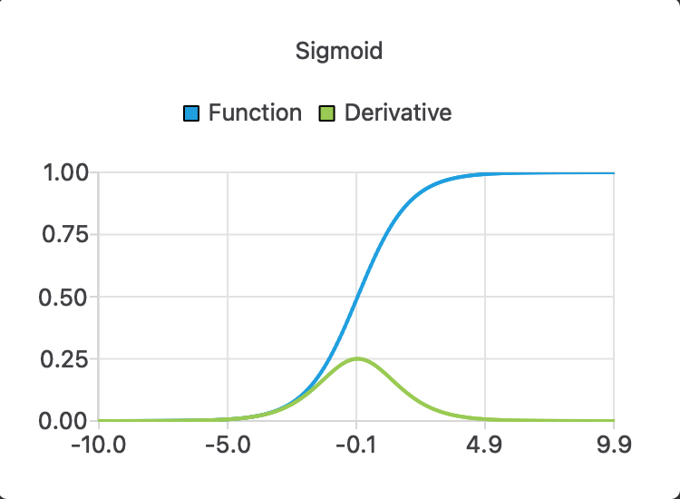

A C++ (23) library for the compile-time computation of the derivative of a function. If a mathematical function
is defined as a generic one (e.g. lambdas), the library can compute the derivative of the function at compile-time.
For example the derivative of the function `f(x) = x^2` is `f'(x) = 2x`. The library is based on the automatic forward
mode of differentiation. The library itself is header-only and does not require compilation. The repository does contain
unit tests and visual examples, though. The unit tests require the Google Test framework and the visual examples require
Qt6. The library is licensed under the MIT license.

## Motivation
The library was created to provide a simple and easy-to-use way to compute the derivative of a function at compile-time.
Let's look at an example.
```cpp
    constexpr auto lambda = [](auto x) {
        return  -2.5*x*x*x + 2. * x * x +3.0 * x + 1.5;
    };

    constexpr double value = 1.0;
    constexpr auto result1 = differentiate_at(lambda, value);
    assert(result1 == -0.5);
```

As one might see, all the variables are `constexpr` and the result is computed at compile-time.
The function is defined as a generic lambda, the feature that was introduced in C++14.
Note, that the function doesn't specify the type of x.

## Usage
There are examples of the usage in google tests (the folder _tests_) and in the visual examples (the folder _visualization_).
For instance, the example differentiate_sigmoid shows the result of the differentiation of the sigmoid function.



## Higher order derivatives
The library can compute higher order derivatives as well. One might use the result of nth differentiation to compute the (n+1)th.
Below is an example
```cpp
    constexpr auto lambda = [](auto x) {
        return  -2.5*x*x*x + 2. * x * x +3.0 * x + 1.5;
    };

    constexpr double value = 1.0;

    constexpr auto derivative1 = differentiate(lambda);
    constexpr auto derivative2 = differentiate(derivative1);
    EXPECT_EQ(derivative2(value), -11.0);

    constexpr auto derivative3 = differentiate(derivative2);
    EXPECT_EQ(derivative3(value), -15.0);

    constexpr auto derivative4 = differentiate(derivative3);
    EXPECT_EQ(derivative4(value), 0.0);

    constexpr auto derivative5 = differentiate(derivative4);
    EXPECT_EQ(derivative5(value), 0.0);
```
As one might see the result of applying the `differentiate` function to a function is another function,
which in turn can be used agai as input to the `differentiate` function. 
## Applications
The library can be used whenever the derivative of a function is needed, which encompasses a wide range of numerical algorithms.
For instance, the library can be used in optimization algorithms, root-finding algorithms, and in the solution of differential equations.
One simple but useful application is the computation of irrational constants, such as `e` and `pi`.
Below is an example of finding the square root of 15 at compile-time.
```cpp
    constexpr auto square_root_inv = [](auto x) {
        return x * x;
    };
    constexpr double value = 15.;

    constexpr auto result = solvers::newton(square_root_inv, value/2., value);
    static_assert(result != 0.0, "Static differentiation failed");
    EXPECT_NEAR(result, std::sqrt(value), 1e-7);
```
As one might see the variable `result` is equal to `std::sqrt(15)`, but the computation is done at compile-time,
which the standard library cannot do. We use the Newton-Raphson method to find the root of the inverse of the square root function.
It requires the first derivative of the function, which is computed at compile-time. The library provides an implementation of this algorithm.
## Requirements
In order for the differentiation to work, the following conditions must be met:
- C++20 is required
- The function must be defined as a generic one (lambda, template function, etc.)
- The function is univariate (i.e. it has only one variable). In the future, the library is planned to be extended to multivariate functions.